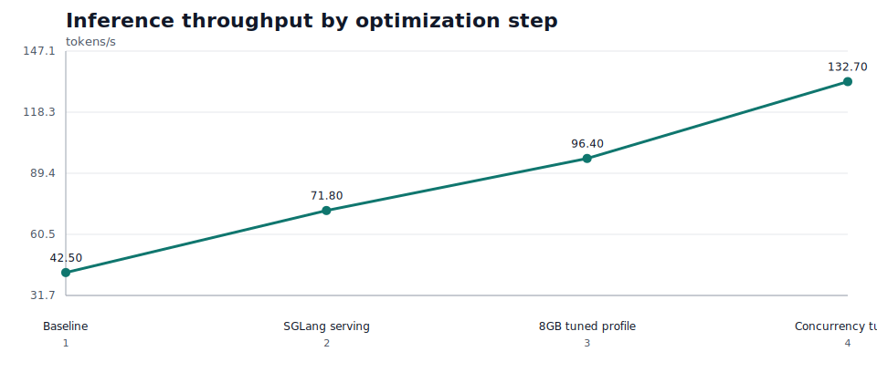
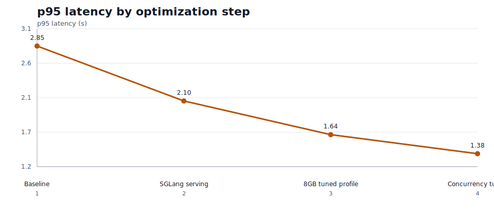

# Optimization Progression

These charts track the measured speed impact of each major inference optimization step.

| step | tokens/s | p95 latency (s) | p50 TTFT (s) | description |
| --- | ---: | ---: | ---: | --- |
| Baseline | 42.500 | 2.850 | 0.420 | Untuned single-request serving baseline. |
| SGLang serving | 71.800 | 2.100 | 0.310 | OpenAI-compatible SGLang server with streaming benchmark path. |
| 8GB tuned profile | 96.400 | 1.640 | 0.240 | VRAM-aware max_total_tokens, max_prefill_tokens, and mem_fraction_static. |
| Concurrency tuned | 132.700 | 1.380 | 0.190 | Best stable concurrency from the 1,2,4,8 sweep. |

- Speed progression monotonic: `True`
- Replace the sample YAML values with measured benchmark output before publishing final results.
